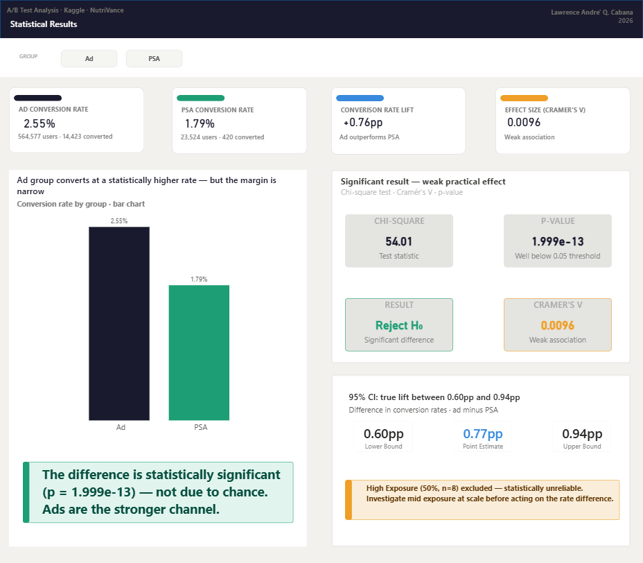
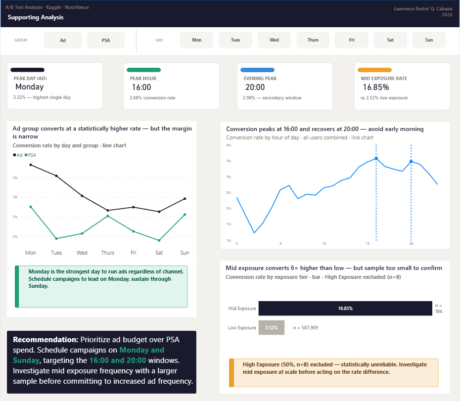

# A/B Test Analysis
**Tool:** Python · Power BI  
**Dataset:** [Kaggle — Marketing A/B Testing Dataset](https://www.kaggle.com/datasets/andrewjayasatyo/ab-testing-ad-vs-psa-effectiveness)  
**Author:** Lawrence André Q. Cabana · [LinkedIn](https://www.linkedin.com/in/lawrence-andr%C3%A9-cabana-1306b7295/)

---

## Overview

This project analyzes the results of an A/B test conducted by NutriVance, a health and wellness e-commerce brand, to determine whether paid advertisements or public service announcements are more effective at driving customer conversions. A chi-square test of independence is applied to evaluate statistical significance, with supporting analysis on ad exposure volume, day-of-week patterns, and hour-of-day patterns to surface actionable targeting insights.

The analysis was conducted in Python using pandas and scipy for data preparation, statistical testing, and aggregation, with Power BI used for visualization and reporting.

---

## Business Problem

NutriVance is evaluating whether its ad spend is generating a statistically significant lift in conversions before committing to either channel as its primary marketing approach. With a limited marketing budget, the business needs a data-driven basis for channel allocation — not an assumption. This analysis tests whether the difference in conversion rates between the ad and PSA groups is significant, quantifies the practical size of that effect, and identifies the timing conditions most associated with higher conversion.

---

## Dataset

- **Source:** Kaggle — Marketing A/B Testing Dataset (andrewjayasatyo/ab-testing-ad-vs-psa-effectiveness)
- **Records:** 588,101 users
- **Features:** User ID, test group assignment, conversion status, total ads shown, day of peak ad exposure, hour of peak ad exposure

---

## Tools Used

| Tool | Purpose |
|---|---|
| Python (pandas, scipy, statsmodels, matplotlib) | Data cleaning, statistical testing, aggregation, exploratory visualization |
| Power BI Desktop | Dashboard and report visualization |

---

## Data Preparation

All data preparation was performed in Python. The following custom column was engineered from existing data:

| Column | Description |
|---|---|
| `exposure volume` | Users bucketed into Low, Mid, and High Exposure tiers based on `total ads` using `pd.cut()` |

**Cleaning steps:**
- Unnamed index column dropped — no analytical value
- No null values present across any column
- No duplicate user IDs detected

**Note on group size imbalance:** The ad and PSA groups have a 24:1 size ratio (564,577 vs 23,524). This does not affect chi-square validity — all expected cell values remain well above the minimum threshold of 5, with the smallest at approximately 594.

---

## Analysis Questions

| # | Question |
|---|---|
| Q1 | Is the difference in conversion rates between the ad and PSA groups statistically significant? |
| Q2 | How large is the practical effect of group membership on conversion? |
| Q3 | What is the estimated true difference in conversion rates, and what range can we be confident in? |
| Q4 | Does ad exposure volume correlate with higher conversion likelihood? |
| Q5 | Are there day-of-week patterns in conversion rate, and do they differ between groups? |
| Q6 | What hours of day are associated with the highest conversion rates? |

---

## Key Findings

- **The ad group converted at 2.55% vs 1.79% for the PSA group** — a statistically significant difference confirmed by a chi-square statistic of 54.01 and a p-value of 1.999e-13, well below the 0.05 threshold
- **Cramér's V of 0.0096 indicates a weak practical effect** — group membership has very little real-world influence on whether a user converts; the difference is real but small
- **The 95% confidence interval places the true lift between 0.60pp and 0.94pp**, with a point estimate of 0.77pp — confirming the ad advantage is consistent but narrow
- **Mid Exposure users convert at 16.85% vs 2.52% for Low Exposure** — a substantial gap, though the Mid Exposure bucket contains only 184 users, making this finding directional rather than conclusive
- **Monday is the strongest conversion day for both groups** — the ad group peaks at 3.32% and the PSA group at 2.26%, making it the clearest day-of-week signal regardless of channel
- **16:00 is the peak conversion hour at 3.08%**, with a secondary recovery at 20:00 at 2.98% — early morning hours (1:00–4:00) show the lowest conversion rates consistently

---

## Recommendation

NutriVance should **prioritize ad budget over PSA spend** — the statistical evidence supports ads as the stronger conversion channel. PSAs can be retained as a low-cost supplementary channel but should not be treated as equivalent in budget allocation.

Campaigns should be scheduled to lead on **Monday**, with **16:00 and 20:00** as the primary delivery windows based on peak conversion hour patterns. Sunday shows a secondary uptick for both groups and is worth including in any always-on schedule.

The mid exposure finding (16.85% conversion rate) is directionally promising but requires a larger sample before committing to increased ad frequency as a strategy. A controlled frequency test with a minimum mid-exposure sample of 1,000+ users is the recommended next step before scaling.

---

## Repository Structure

```
├── notebook/
│   └── analysis.ipynb                   # Data cleaning, statistical tests, and supporting analysis
├── findings/
│   └── ab_test_findings.pdf             # Full write-up with findings and implications
├── visuals/
│   ├── page1_statistical_results.png
│   └── page2_supporting_analysis.png
└── README.md
```

---

## Dashboard Preview

### Page 1 — Statistical Results


### Page 2 — Supporting Analysis


---

*This project is part of an ongoing data analyst portfolio. More projects coming soon.*
